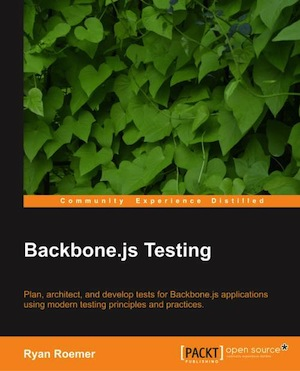
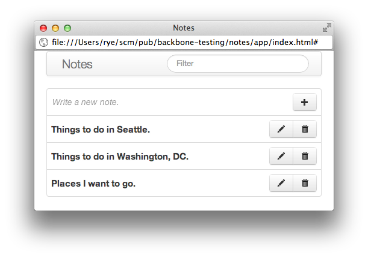
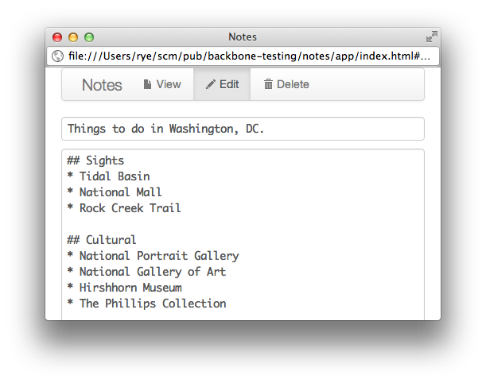
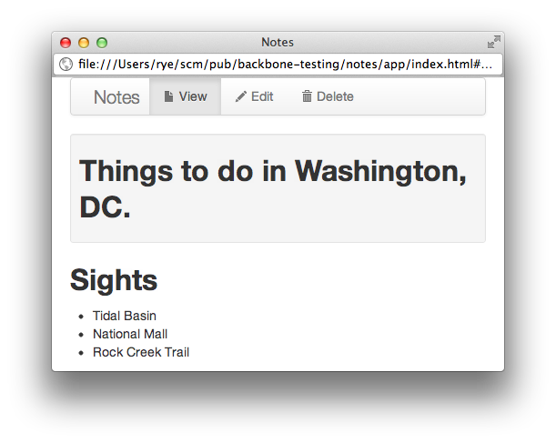

# Backbone.js Testing
Apps, suites, and examples for Backbone.js test development.

## Introduction
This site provides materials and resources for developing and testing
[Backbone.js][backbone] web applications. All of the application and test
examples for the book **[Backbone.js Testing][packt]** can be found here,
grouped by chapter.
We also provide a reference Backbone.js application -
**[Notes][notes_demo]** - for creating and viewing notes, which we use
throughout the examples in the book.

The core set of Backbone.js application technologies we cover includes:

* **[jQuery](http://jquery.com/)**
* **[Underscore.js](http://underscorejs.org/)**
* **[Backbone.js](http://backbonejs.org/)**

We write a test infrastructure built on the following (fantastic) test
libraries.

* **[Mocha](http://visionmedia.github.com/mocha/)**
* **[Chai](http://chaijs.com/)**
* **[Sinon.JS](http://sinonjs.org/)**

The source code for everything is available from the project's
[GitHub repository][gh]. If you find any errors or issues in content or
code, please file a [bug report][gh_bugs] and we'll fix things up in short
order. For those interested in extending our testing examples or helping
out, please see our [contribution and development guide][contrib].

[gh]: https://github.com/ryan-roemer/backbone-testing/
[gh_bugs]: https://github.com/ryan-roemer/backbone-testing/issues
[contrib]: #development

## Book
**[Backbone.js Testing][packt]** by [Ryan Roemer][roemer] walks through the
fundamentals of test-driven development for Backbone.js applications. All of
the code samples are directly used in the book - it is essentially your
narrative guide to this repository.

[][packt]

A short description of the book from the [Packt Publishing][packtpub]
[website][packt]:

> Frontend web applications are soaring in popularity and the
> Backbone.js library is leading this charge with a modular,
> lightweight approach for organizing JavaScript web applications. At
> the same time, testing client-side JavaScript and Backbone.js
> programs remains a difficult and tedious undertaking.
>
> Backbone.js Testing brings sensible practices and current techniques
> to the challenges of Backbone.js test development. The book
> introduces fundamental testing concepts, comprehensive test
> infrastructure design, and practical exercises to easily and
> systematically test modern JavaScript web applications.
>
> The book progresses from Mocha test suites and Chai assertions to
> advanced test mocks and stubs with Sinon.JS. The requisite libraries
> and utilities are introduced with in-depth examples and best
> practices for integration with your applications. The book guides
> you through the test planning and implementation processes for your
> application models, views, routers, and other Backbone.js
> components.
>
> Backbone.js Testing gives you the tools, examples, and assistance to
> test your Backbone.js web applications thoroughly, quickly, and with
> confidence.

[roemer]: http://loose-bits.com/about.html
[packtpub]: http://www.packtpub.com/
[packt]: http://www.packtpub.com/backbonejs-testing/book

## Compatibility
The application and test samples should work for the following browser /
version combinations:

* Chrome: 7+
* Safari: 5+
* Firefox: 4+
* Internet Explorer: 9+

See the Chai [installation notes](http://chaijs.com/guide/installation/) for
more compatibility information. *Note* that the Chai `should` object
prototype extension is not compatible with IE 9 and lower.

## Notes App
**[Notes][notes_demo]** is a simple personal note manager, written in
Backbone.js. We provide two versions - a "quick and easy" `localStorage` based
application that works in your browser with no additional setup, and a
"classic" application with a full REST backend.

### The Tour
The Notes application home page lists existing notes (by creation date), and
provides a form field to create a new note with a title. A filter field is
available in the menu bar to limit the list of displayed notes by title.

Clicking on the edit icon brings us to the single note view, with a simple
form editor for the title and text body fields of the note. The body of a
note is written using [Markdown][markdown] formatting.

Clicking on the view menu tab switches us to the viewing pane, which renders
the note's Markdown and produces our displayed note.

The Notes application is written using [Bootstrap][bootstrap]'s responsive
libraries and should render fine on mobile devices, tablets, and pretty much
anything else.

[markdown]: http://daringfireball.net/projects/markdown/

### LocalStorage App
The directory "`notes/app`" contains the standalone application, which uses
HTML5 [localStorage][ls] as a backing store. Some useful links to get you
started:

* **[App demo][notes_demo]**: Online demo for you to try out. Because the app
  saves to local storage, your notes will be preserved across browser sessions
  (for the same browser).
* **[Test Suite][notes_test]**: The full Mocha / Chai / Sinon.JS test suite run
  in a single driver page.
* **[Code Coverage][notes_cov]**: Runs the above test suite with full
  browser-side code coverage thanks to the awesome
  [Blanket.js](http://blanketjs.org) coverage library.

[notes_demo]: ./notes/app/index.html
[notes_test]: ./notes/test/test.html
[notes_cov]: ./notes/test/coverage.html
[ls]: https://developer.mozilla.org/en-US/docs/DOM/Storage#localStorage

### Server-Backed App
An alternative version of the application uses
[MongoDB](http://www.mongodb.org/) instead of `localStorage` for notes data and
can be found in the "`notes-rest`" directory. The application is
served via a [Node.js](http://nodejs.org/)/[Express](http://expressjs.com/)
application located in "[notes-rest/server.js](./notes-rest/server.js)".

Although we don't provide an online demo application, the full application
**[test suite][notes_rest_test]** is available online using Sinon.JS
[fake servers](http://sinonjs.org/docs/#server) to fake out the requirement
of having a real backend MongoDB server for the `App.Collections.Notes`
tests. The test suite is nearly identical to the localStorage application tests
for all of the other tests.

[notes_rest_test]: ./notes-rest/test/test.html

The server requires [Node.js](http://nodejs.org/download/) and
[MongoDB](http://docs.mongodb.org/manual/installation/) installations.
Once you have these installed, you can change into the root of this repository
and install all of the project libraries:

    $ npm install

To run the sample server application, you will need two terminal windows.
In the first window, start up MongoDB:

    $ npm run-script mongo-start

In the second window, start up the Express server:

    $ npm start

And from there you can navigate a browser to:
[http://127.0.0.1:4321/app/](http://127.0.0.1:4321/app/)
and see the application running. Note that you can control several application
options by setting console environment variables:

* `MONGO_ADDR`: MongoDB host address (default `127.0.0.1`).
* `MONGO_PORT`: MongoDB port (default `27027`).
* `ADDR`: Express server host address (default `127.0.0.1`).
* `PORT`: Express server port (default `4321`).

For example:

    $ export PORT=4323; npm start

runs the server on port 4323 instead of 4321 (the default).

## Chapter Examples
The examples for each chapter are provided in the "chapters" directory,
separated by number. We also provide a driver page for (nearly) all of
[the non-application tests](./chapters/test.html).

### Chapter 1: Setting up a Test Infrastructure

* **[Trying out the test libraries](./chapters/01/test/test.html)**: Some
  first basic unit tests using Mocha, Chai, and SinonJS.
  * [hello.spec.js](./chapters/01/test/js/spec/hello.spec.js)

* **[Test Failures](./chapters/01/test/test-failure.html)**:
  Different types of test failures.
  * [failure.spec.js](./chapters/01/test/js/spec/failure.spec.js)

* **[Test Timing](./chapters/01/test/test-timing.html)**:
  Tests that take different times, which Mocha annotates for "medium"
  and "slow" tests. Also has one test timeout failure.
  * [timing.spec.js](./chapters/01/test/js/spec/timing.spec.js)

### Chapter 2: Creating a Backbone.js Application Test Plan

* **[Tests](./chapters/02/test/test.html)**:
  Initial simple tests for a Backbone.js application.
  * [namespace.spec.js](./chapters/02/test/js/spec/namespace.spec.js):
    Verifies [namespace](./notes/app/js/app/namespace.js)
    objects are correctly setup.
  * [models/note.spec.js](./chapters/02/test/js/spec/models/note.spec.js):
    Tests the application model
    [`App.Models.Note`](./notes/app/js/app/models/note.js).

### Chapter 3: Test Assertions, Specs, and Suites

* **[BDD Interface](./chapters/03/test/test-bdd.html)**: Tests using
  [Mocha](http://visionmedia.github.com/mocha/#bdd-interface)
  and [Chai](http://chaijs.com/api/bdd/) **BDD** styles.
  * [bdd.spec.js](./chapters/03/test/js/spec/bdd.spec.js)

* **[TDD Interface](./chapters/03/test/test-tdd.html)**: Tests using Mocha
  **[TDD](http://visionmedia.github.com/mocha/#tdd-interface)** and
  Chai [`assert`](http://chaijs.com/api/assert/) styles.
  * [tdd.js](./chapters/03/test/js/test/tdd.js)

* **[Chai Assertions](./chapters/03/test/test-chai.html)**: Tests using
  a variety of [Chai BDD](http://chaijs.com/api/bdd/) assertions.
  * [chai-chains.spec.js](./chapters/03/test/js/spec/chai-chains.spec.js):
  Language chains.
  * [chai-values.spec.js](./chapters/03/test/js/spec/chai-values.spec.js):
  Value properties.
  * [chai-comparisons.spec.js](./chapters/03/test/js/spec/chai-comparisons.spec.js):
  Comparison functions.
  * [chai-objects.spec.js](./chapters/03/test/js/spec/chai-objects.spec.js):
  Object and array assertions.
  * [chai-errors.spec.js](./chapters/03/test/js/spec/chai-errors.spec.js):
  Exception handling.

* **[Mocha `only`](./chapters/03/test/test-only.html)**: Tests using the Mocha
  `only` test modifier to run a single spec.
  * [mocha-only.spec.js](./chapters/03/test/js/spec/mocha-only.spec.js)

* **[Mocha `skip`](./chapters/03/test/test-skip.html)**: Tests using the Mocha
  `skip` test modifier to skip one or more specs.
  * [mocha-skip.spec.js](./chapters/03/test/js/spec/mocha-skip.spec.js)

* **[Mocha Pending Tests](./chapters/03/test/test-pending.html)**: A basic
  skeleton suite with empty specs (e.g., no test callback), which are all in
  "pending" state during a test run. A great test development practice is to
  declare specs describing behavior without functions during the initial
  design phanse. The specs can later be implemented in parallel with the
  underlying application components, ensuring that the desired behavior is
  correctly implemented.
  * [notes-pending.spec.js](./chapters/03/test/js/spec/collections/notes-pending.spec.js)

* **[Tests](./chapters/03/test/test.html)**:
  Continue tests for the **[Notes][notes_demo]** Backbone.js application.
  * [collections/notes.spec.js](./chapters/03/test/js/spec/collections/notes.spec.js):
    Tests the collection [`App.Collections.Notes`](./notes/app/js/app/collections/notes.js).
  * [views/note-view.spec.js](./chapters/03/test/js/spec/views/note-view.spec.js):
    Tests the view [`App.Views.NoteView`](./notes/app/js/app/views/note-view.js),
    which renders model [Markdown][markdown]
    data into HTML.

### Chapter 4: Test Spies

* **[Sinon.JS Spies](./chapters/04/test/test-sinon.html)**: Various test uses
  for Sinon.JS [spies](http://sinonjs.org/docs/#spies).
  * [sinon.spec.js](./chapters/04/test/js/spec/sinon.spec.js)

* **[Tests](./chapters/04/test/test.html)**:
  Tests for the **[Notes][notes_demo]** Backbone.js application that use
  Sinon.JS spies.
  * [views/note-nav.spec.js](./chapters/04/test/js/spec/views/note-nav.spec.js):
    Tests the [`App.Views.NoteNav`](./notes/app/js/app/views/note-nav.js)
    view, which mediates events for the single page navigation menu bar.
  * [views/note.spec.js](./chapters/04/test/js/spec/views/note.spec.js):
    Tests the [`App.Views.Note`](./notes/app/js/app/views/note.js)
    view, which wraps all of the other single note views and model.

### Chapter 5: Test Stubs and Mocks

* **[Sinon.JS Stubs](./chapters/05/test/test-stubs.html)**: Tests using
  Sinon.JS [stubs](http://sinonjs.org/docs/#stubs).
  * [stubs.spec.js](./chapters/05/test/js/spec/stubs.spec.js)

* **[Sinon.JS Mocks](./chapters/05/test/test-mocks.html)**: Tests using
  Sinon.JS [mocks](http://sinonjs.org/docs/#mocks).
  * [mocks.spec.js](./chapters/05/test/js/spec/mocks.spec.js)

* **[Tests](./chapters/05/test/test.html)**:
  Tests for the **[Notes][notes_demo]** Backbone.js application with Sinon.JS
  stubs and mocks.
  * [views/notes-item.spec.js](./chapters/05/test/js/spec/views/notes-item.spec.js):
    Tests the [`App.Views.NotesItem`](./notes/app/js/app/views/notes-item.js)
    view, which displays a table row for a single note in the "all notes"
    list.
  * [routers/router.spec.js](./chapters/05/test/js/spec/routers/router.spec.js):
    Tests an **abbreviated** version of the
    [`App.Routers.Router`](./chapters/05/test/js/spec/routers/router.js)
    router, implementing the route matching logic, but omitting the actual
    view creation and display. The tests that we create a good starting point
    for testing routers, but please see the Notes application source
    for the
    [real `App.Routers.Router` source](./notes/app/js/app/routers/router.js)
    and [full "routers/router.spec.js"](./notes/test/js/spec/routers/router.spec.js)
    file.

### Chapter 6: Automated Web Testing
We don't introduce any new tests in Chapter 6, instead focusing on automating
all of the application and chapter tests we have provided in this respository.
See the next section for a discussion of test automation with
[PhantomJS][phantom].

## Automated Tests
All of the tests for the Notes application and the chapter
samples can be run in the [PhantomJS][phantom] headless WebKit
engine. Simply install the Node.js dependencies:

    $ npm install

and [install PhantomJS][phantom-install] on your development machine.
Note that as of v3.0.0, `mocha-phantomjs` requires PhantomJS v1.9.1 or above.

From there, you can use the `mocha-phantomjs` binary to run any HTML test
driver page from the command line, e.g.:

    $ mocha-phantomjs notes/test/test.html

As a helper, the following script command will run nearly all of the
Notes application and chapter unit tests:

    $ npm test

We run all of these tests automatically using (the awesome) [Travis CI][trav]
continuous integration service. Travis watches the GitHub repository containing
this project and when it detects the code has changed, launches new builds
and invokes the PhantomJS tests above.

Travis even provides a convenient image status indicator, that we display
below, so that we can display the *always current* build status of our code:

[![Build Status][trav_img]][trav_site]

Setting all of this up is as simple as adding a Travis configuration file
".travis.yml" as follows:

    language: node_js
    node_js:
      - 0.8
      - 0.10

This instructs Travis to test out the latest Node.js versions for v0.8 and
v0.10. By default, Travis already has PhantomJS installed and will run
`npm install` and `npm test` on any Node.js project, which conveniently
sets up and invokes all of our PhantomJS tests.

Our actual "[.travis.yml](./.travis.yml)" file runs different commands than
the default `npm test` to add things like style checking. But, the overall
Travis configuration is essentially the same.

[trav]: https://travis-ci.org/
[trav_img]: https://travis-ci.org/ryan-roemer/backbone-testing.png
[trav_site]: https://travis-ci.org/ryan-roemer/backbone-testing
[trav_cfg]: ./.travis.yml

## Additional Tools
There are many additional testing libraries and plugins specifically suited
to testing Backbone.js applications beyond the core test stack we use in the
application and chapter examples above.

### Chai
Chai has a rich [plugin](http://chaijs.com/plugins) ecosystem, with libraries
that enhance the core Chai assertion statement library, provide more specific
failure messages, and make application behavior easier to express.

Plugins that are used in some examples:

* **[sinon-chai](http://chaijs.com/plugins/sinon-chai)**: Allows Chai to make
  Sinon.JS assertions like `expect(spy).to.have.been.calledWith(42)` instead
  of the Sinon.JS native `sinon.assert.calledWith(spy, 42)`.

Additional plugins not used in the examples:

* **[chai-jquery](http://chaijs.com/plugins/chai-jquery)**: Adds
  assertions for jQuery functions and attributes like `data()`, `class()`,
  `id()`, and `hidden()`.
* **[chai-backbone](http://chaijs.com/plugins/chai-backbone)**: Adds
  Backbone.js specific assertions such as `expect(model).to.trigger()` and
  `expect("hash/fragment").to.route.to()`.

## Libraries & Versions
All frontend libraries used in this repository for the sample apps and chapter
examples are provided in the "vendor" directory.

Note that this repository has been updated since the publication of
**[Backbone.js Testing][packt]** on July 12, 2013. The enumerated versions of
all third party libraries are indicated by the most current version in the
repository with the published version optionally provided in parenthesis when
different.

The core Backbone.js components used are:

* **[jQuery][jquery]**: `2.0.3` (*2.0.2*)
* **[Underscore.js][underscore]**: `1.5.1` (*1.4.4*)
* **[Backbone.js][backbone]**: `1.0.0`
* **[Backbone.localStorage][backbone-ls]**: `1.1.6` (*1.1.5*)
* **[JSON][json_js]**: *For older browsers*

The sample Notes application also uses:

* **[Twitter Bootstrap][bootstrap]**: `2.3.2`
* **[Showdown][showdown]**: `0.3.1`

The frontend test libraries we use are:

* **[Mocha][mocha]**: `1.12.0` (*1.9.0*)
* **[Chai][chai]**: `1.7.2` (*1.7.1*)
* **[Sinon.JS][sinon]**: `1.7.3`

The test plugins include:

* **[Sinon-Chai][sinon-chai]**: `2.4.0`
* **[Mocha-PhantomJS][mocha-phantom]**: `3.1.0` (*2.0.3*)

### Notes

#### Published Versions and Code

The repository was tagged with git as `published-1.0` for the code samples
that are shipped with the book as it went to press. To check out the published
version in this repository, type:

    $ git checkout tags/published-1.0

This will switch all libraries, application code, and tests to the version that
directly matches the book.

#### Mocha-PhantomJS and PhantomJS

As of v3.x.x and higher, Mocha-PhantomJS requires PhantomJS v1.9.1 or higher.

#### Mocha-PhantomJS and Mocha Compatibility

Mocha version 1.10.0 and 1.11.0 introduced incompatibilities with
Mocha-PhantomJS. Modern versions of both libraries are now compatible, e.g.,
Mocha v1.12.0+ and Mocha-PhantomJS v3.1.0+.

For this historically minded, the evolution of this issue is documented in the
following tickets:

* [Mocha #770](https://github.com/visionmedia/mocha/issues/770)
* [Mocha-PhantomJS #58](https://github.com/metaskills/mocha-phantomjs/issues/58)

**[Backbone.js Testing][packt]** shipped with Mocha v1.9.0 and Mocha-PhantomJS v2.0.3 to
avoid the issue.

## Licenses
All code not otherwise specified is Copyright 2013 Ryan Roemer.
Released under the [MIT](./LICENSE.txt) License.

This repository contains various libraries from other folks, and are licensed
as follows:

* [Backbone.js][backbone] is Copyright Jeremy Ashkenas and licensed under the
  [MIT](https://github.com/documentcloud/backbone/blob/master/LICENSE) license.

* [Underscore.js][underscore] is Copyright Jeremy Ashkenas and licensed under
  the [MIT](https://github.com/documentcloud/underscore/blob/master/LICENSE)
  license.

* [jQuery][jquery] is Copyright jQuery Foundation and licensed under the
  [MIT](https://github.com/jquery/jquery/blob/master/MIT-LICENSE.txt) license.

* [Backbone.localStorage][backbone-ls] is Copyright Jerome Gravel-Niquet and
  licensed under the MIT license.

* [JSON][json_js] is Public Domain software created by Douglas Crockford.

* [Mocha][mocha] is Copyright TJ Holowaychuk and licensed under the
  [MIT](https://github.com/visionmedia/mocha/blob/master/LICENSE) license.

* [Chai][chai] is Copyright Jake Luer and licensed under the
  [BSD](https://github.com/cjohansen/Sinon.JS/blob/master/LICENSE) license.

* [Sinon-Chai][sinon-chai] is Copyright Domenic Denicola and licensed under
  what we will politely approximate to a
  "[public domain](https://github.com/domenic/sinon-chai/blob/master/LICENSE.txt)"
  license.

* [Sinon.JS][sinon] is Copyright Christian Johansen and licensed under the
  [BSD](https://github.com/cjohansen/Sinon.JS/blob/master/LICENSE) license.

* [Twitter Bootstrap][bootstrap] is Copyright Twitter, Inc. and licensed under
  the [Apache v2.0](https://github.com/twitter/bootstrap/blob/master/LICENSE)
  license.

* [Showdown][showdown] is Copyright Corey Innis and licensed under the
  [BSD](https://github.com/coreyti/showdown/blob/master/license.txt) license.

* [Mocha-PhantomJS][mocha-phantom] is Copyright Ken Collins and licensed under the
  [MIT](https://github.com/metaskills/mocha-phantomjs/blob/master/MIT-LICENSE)
  license.

* [Blanket.js][blanket] is Copyright Alex Seville and licensed under the
  [MIT](https://github.com/alex-seville/blanket/blob/master/LICENSE-MIT)
  license.

[bootstrap]: https://github.com/twitter/bootstrap
[jquery]: https://github.com/jquery/jquery
[json_js]: https://github.com/douglascrockford/JSON-js
[mocha]: https://github.com/visionmedia/mocha
[mocha-phantom]: https://github.com/metaskills/mocha-phantomjs
[phantom]: http://phantomjs.org/
[phantom-install]: http://phantomjs.org/download.html
[chai]: https://github.com/chaijs/chai
[sinon-chai]: https://github.com/domenic/sinon-chai
[underscore]: https://github.com/documentcloud/underscore
[backbone]: https://github.com/documentcloud/backbone
[backbone-ls]: https://github.com/jeromegn/backbone.localStorage
[sinon]: https://github.com/cjohansen/Sinon.JS
[showdown]: https://github.com/coreyti/showdown
[blanket]: https://github.com/alex-seville/blanket

## Development
For those who would like to get under the hood, or help out with the
application or test examples.

### Scripts, Commands
For pretty much everything, you will need to install
[PhantomJS][phantom-install], a Node.js environment, and
the development NPM dependencies:

    $ npm install

From there, there are various NPM script helpers for style checking and tests:

    # Run style checks for server, client, and both.
    $ npm run-script style-server
    $ npm run-script style-client
    $ npm run-script style

    # Run headless tests for the application, individual chapters, all chapters
    # as one big test, and all of these together.
    $ npm run-script test-app
    $ npm run-script test-rest
    $ npm run-script test-chaps
    $ npm run-script test-chaps-all
    $ npm test

    # Run all style checks and headless tests.
    $ npm run-script check

The file "README.md" is transformed from markdown into the HTML page
"index.html", and can be compiled once, or watched for changes with the
following commands.

    $ npm run-script docs
    $ npm run-script docs-watch

### Contributions
Bugs, issues and fixes for any of the application or test code examples are
most welcome. Please file a GitHub
[issue](https://github.com/ryan-roemer/backbone-testing/issues) or pull request
for any changes. Pull requests should be able to pass

    $ npm run-script check

without any errors.
